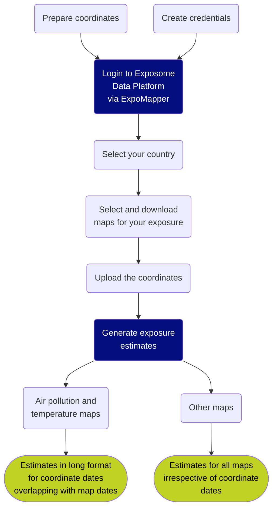

# ExpoMapper - Environmental Exposure Generator

ExpoMapper is an R Shiny application for generating coordinate-based environmental exposures. It supports research in exposomics, epidemiology, and geoscience by providing an interactive interface to access and process exposure data from the EU-funded EXPANSE project, accessible via the [Exposome Data Platform](https://exposome.uu.nl/).

ExpoMapper will be soon available at [GitHub](https://github.com/justiina/ExpoMapper.git).

## Overview

ExpoMapper enables researchers to efficiently create exposure estimates for sets of geographical coordinates. Through an intuitive Shiny interface, users can connect to the Exposome Data Platform, explore available environmental exposure maps, and generate estimates for specific study locations.

## Features

* Interactive Shiny interface
* Seamless integration with the Exposome Data Platform
* Automated exposure retrieval and processing
* Coordinate-based exposure estimation
* Export-ready outputs for downstream analysis

## Workflow

### 1. Outside ExpoMapper

Before using the tool, ensure you have the necessary credentials and prepared data:
* Generate credentials for the Exposome Data Platform
* Clean and prepare coordinate data

### 2. Inside ExpoMapper

Once your setup is complete, ExpoMapper handles the rest:
1. Connect to the Exposome Data Platform
2. Retrieve available exposure maps for your selected country
3. Select and download the maps relevant to your exposure of interest
4. Generate and save exposure estimates for each coordinate

### Flowchart

## Acknowledgements

ExpoMapper was developed as part of the EU-funded [IHEN project](https://humanexposome.net/), supporting research in environmental exposures and their impact on human health.